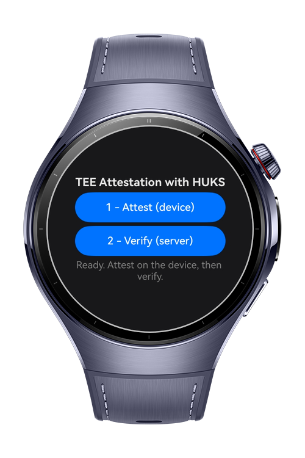
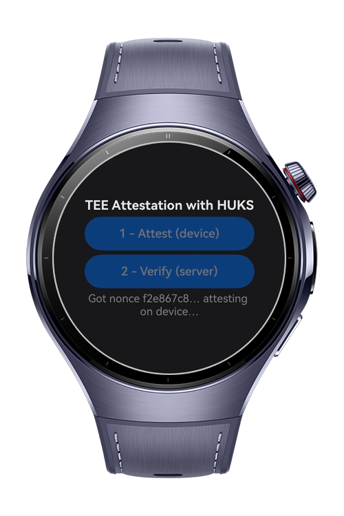
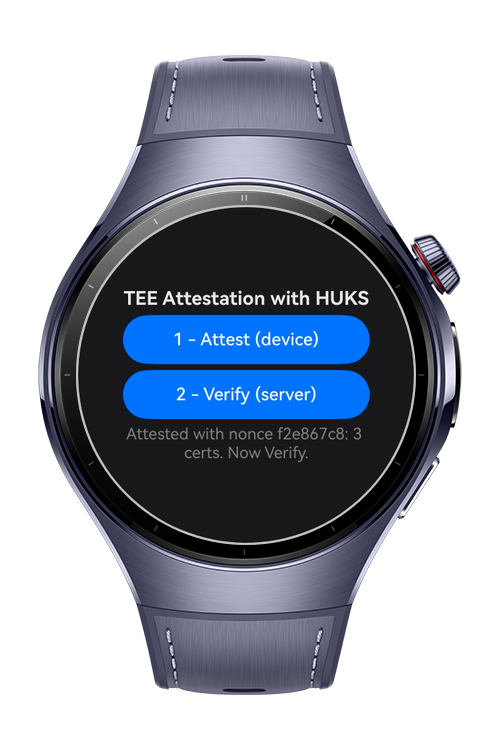
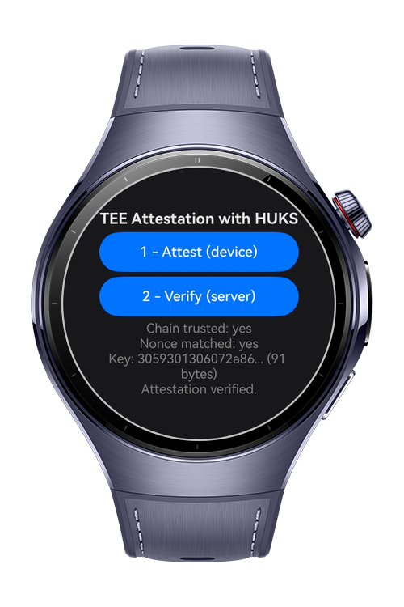

> **Note:** To access all shared projects, get information about environment setup, and view other guides, please visit [Explore-In-HMOS-Wearable Index](https://github.com/Explore-In-HMOS-Wearable/hmos-index).

# How to Implement HUKS Attestation
This sample demonstrates how to integrate **Universal Keystore Kit** to implement a real device verification system using TEE(Trusted Execution Environment) and HUKS

# Preview
<div>
  
  
  
  
</div>

# Use Cases
- Implement a security layer by verifying that the requests coming to your server are from real devices

# Tech Stack
- **Language:** ArkTS
- **Framework**: HarmonyOS SDK 6.0.0(20)
- **Tools** DevEco Studio 6.1.1 Release
- **Libraries**:
  - **Universal Keystore Kit:** `huks` used to attest the device.
  - **Device Certificate Kit:** `cert` interface used to parse the certificate chain server-side.
  - **Localization Kit:** `resourceManager` used to load the pinned root CA (PEM)
  - **ArkTS:** `util` used for the `TextEncoder` and `TextDecoder`
  - **Basic Services Kit:** `BusinessError` used for typed error handling

# Directory Structure
```
entry/src/main/
├── ets/
│   ├── attest/
│   │   ├── app/                            # Device Attestation
│   │   │   └── HuksAttestation.ets        
│   │   └── server/                         # Simulated server implementation
│   │       ├── Asn1.ets                    # Minimal DER (ASN.1) reader
│   │       ├── AttestationServer.ets       # Assigns a challenge
│   │       └── AttestationVerifier.ets     # Verifies the certificate chain
│   └── pages/
│       └── Index.ets                       # UI Implementation for attest and verify
├── module.json5
└── resources/
    └── rawfile/
        └── huawei_attest_root_ca.pem       # Official Huawei Root CA
```

# Constraints and Restrictions
## Supported Devices
- Huawei Watch 5/6
- Huawei Watch Kids X1

# LICENSE
**How to Implement HUKS Attestation** is distributed under the terms of the **MIT License**.
See the [LICENSE](/LICENSE) for more information.
